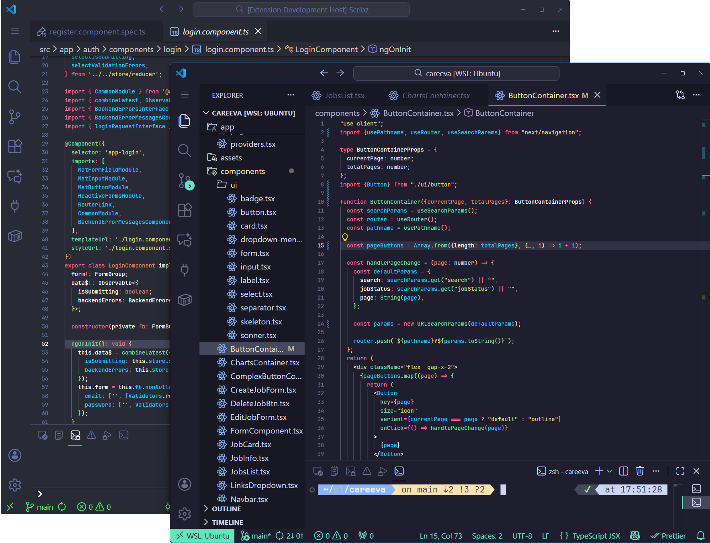

<h3 align="center">
	 
	
	Mynthra for <a href="https://code.visualstudio.com">VSCode</a>
	
</h3>

    
    
    

   

---

## 🎨 About Mynthra 🍃  

**Mynthra** is a modern, **dark VSCode theme** 🌑✨ designed for developers who crave a **clean, focused, and visually harmonious coding environment**.  

- Carefully crafted **syntax colors** for JavaScript, TypeScript, HTML, CSS, JSON, and backend code (Node.js) 🌿  
- **Eye-friendly palette** to reduce strain during long coding sessions 🍃  
- **Minimalist design** with mint-green accents for functions, keywords, and important code markers 🍀  
- Two variations for your coding vibe:  
  - **Mynthra** — classic Mynthra theme  
  - **Mynthra Vaporwave** — dreamy, alternative color palette 🌌💜 (purely cosmetic, no extra code runs on your system)  

Whether you’re debugging 🔧, crafting functions 🖋️, or exploring your projects 🌱, Mynthra keeps your code readable, vibrant, and visually soothing 🍂✨.  

---

## 💻 Installation

1. Open VS Code  
2. Press `Ctrl+P` (Windows/Linux) or `Cmd+P` (macOS) and type:  

- **VSCode Marketplace:** [Install from Marketplace](https://marketplace.visualstudio.com/items?itemName=hamzakargin.Mynthra)  
- **Manual installation:** Download the latest VSIX from GitHub releases and open it in VSCode using **"Extensions: Install from VSIX..."**  

---

  

  Copyright &copy; 2025-present Hamza Kargın 

